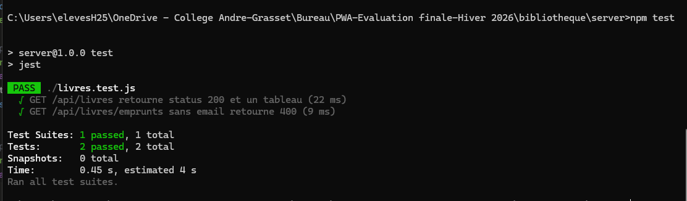
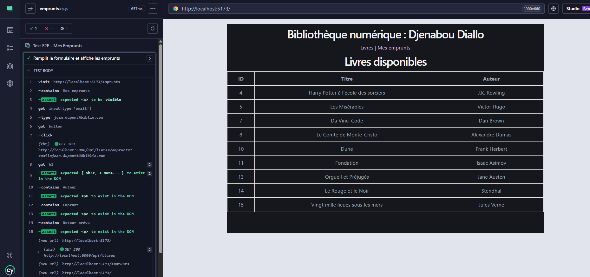

# 📚 Bibliothèque Numérique

Application web full-stack permettant de consulter les livres disponibles et de visualiser les emprunts par utilisateur.

🔗 **[Voir l'application en ligne](https://djenabou-diallo-evaluation-finale-h.vercel.app)**

---

## Technologies utilisées

**Frontend** : React, Vite, Axios, React Router Dom  
**Backend** : Node.js, Express.js  
**Base de données** : MySQL  
**Tests** : Jest, Supertest, Cypress  
**Documentation** : Swagger  
**Déploiement** : Vercel, Render, Railway

---

## Fonctionnalités

- Consulter la liste des livres disponibles
- Rechercher les emprunts par email utilisateur

---

## Endpoints API

| Méthode | Route | Description |
|---------|-------|-------------|
| GET | /api/livres | Liste des livres disponibles |
| GET | /api/livres/emprunts?email= | Emprunts d'un utilisateur |

Documentation Swagger disponible sur : `http://localhost:5000/api-docs`  
En ligne : `https://djenabou-diallo-evaluation-finaleh26.onrender.com/api-docs`

---

## Installation

### Prérequis
- Node.js v18+
- MySQL

### 1. Cloner le projet
```bash
git clone https://github.com/djenabou-diallo/bibliotheque-numerique
```

### 2. Configurer les variables d'environnement
Copie le fichier `.env.example` en `.env` dans le dossier `server/` et remplis les valeurs :
```
PORT=5000
DB_HOST=localhost
DB_USER=root
DB_PASSWORD=
DB_NAME=bibliotheque
```

### 3. Lancer le backend
```bash
cd server
npm install
node server.js
```

### 4. Lancer le frontend
```bash
cd client
npm install
npm run dev
```

---

## Tests

### Jest + Supertest
```bash
cd server
npm test
```


### Cypress E2E
```bash
cd client
npx cypress open
```


---

## Déploiement

| Service | Rôle | Lien |
|---------|------|------|
| Vercel | Frontend | [djenabou-diallo-evaluation-finale-h.vercel.app](https://djenabou-diallo-evaluation-finale-h.vercel.app) |
| Render | Backend | [onrender.com/api/livres](https://djenabou-diallo-evaluation-finaleh26.onrender.com/api/livres) |
| Railway | Base de données MySQL | — |

---

## Auteure

**Djenabou Diallo** 
